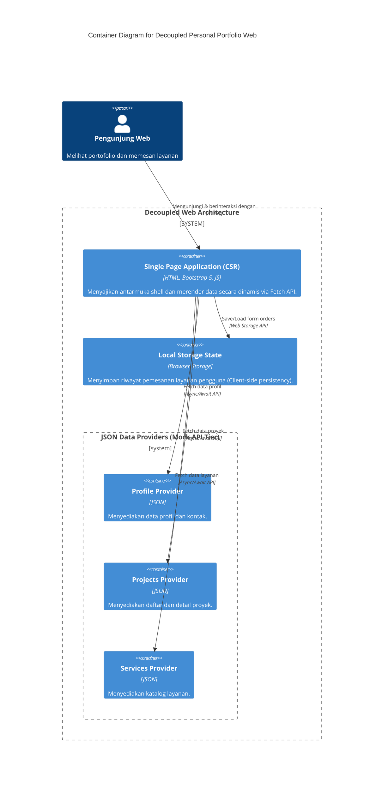

# Refactoring Arsitektural Personal Portfolio & Service Portal

**Mata Kuliah:** Pemrograman dan Pengujian Aplikasi Web (PPW) 2026 — Minggu 4
**Judul Tugas:** Implementasi Decoupled Multi-Tier, Dynamic Client-Side Rendering (CSR), dan Network Performance Profiling
**Pengembang:** Jaya Bestina Simbolon
**NIM:** 12S24023
**WhatsApp:** +6281396305139
**LinkedIn:** [Jaya Bestina Simbolon](https://www.linkedin.com/in/jaya-bestina-simbolon)
**Program Studi:** Sarjana Sistem Informasi — Semester 5
**Institusi:** Institut Teknologi Del

**Live Deployment:** [GitHub Pages Live Demo](https://JayaBestinaSimbolon.github.io/ppw-2026-week2-12S24023/)

---

## 1. Arsitektur Sistem C4 Container Model

Pada minggu ini, aplikasi web dimodernisasi dari monolitik statis menjadi arsitektur multi-tier kontemporer dengan pemisahan lapisan logika (Separation of Concerns).



### Narasi Ilmiah Pemisahan Minat (Separation of Concerns)
Pemisahan minat (Separation of Concerns) pada arsitektur ini membagi sistem menjadi lapisan yang independen:
1. **Presentation Tier**: `index.html`, `css/`, dan logika rendering UI di `js/app.js`. Lapisan ini hanya fokus pada perakitan DOM, manajemen state UI (Loading, Success, Empty, Error), dan interaksi pengguna.
2. **API/Service Logic Tier**: Diwakili oleh `js/api-service.js` yang menangani komunikasi jaringan asinkron (Fetch API), parsing respons, dan penanganan error defensif.
3. **Data Storage Tier**: Data monolitik (hardcoded) diekstraksi ke penyedia data modular dalam format JSON (`data/projects.json`, `data/services.json`, `data/profile.json`). Pemesanan layanan juga dipisahkan dengan penyimpanan ke dalam `localStorage`.

Arsitektur ini mendekarbonisasi logika antarmuka dari data, mencegah Cross-Site Scripting (XSS) dengan merender secara aman, dan sangat mengurangi waktu muat awal dokumen HTML (TTFB).

---

## 2. Tabel Komparasi "Sebelum vs Sesudah Refactoring"

| Aspek Arsitektural | Sebelum (Monolitik Statis - Minggu 3) | Sesudah (Decoupled CSR - Minggu 4) |
| :--- | :--- | :--- |
| **Sumber Data** | Terukir langsung (hardcoded) di `index.html` | Modular JSON API (`data/projects.json`, dll.) |
| **Pendekatan Rendering** | Static HTML (Perakitan DOM saat authoring) | Client-Side Rendering (CSR) dinamis via JavaScript |
| **Manajemen UI Modal** | Banyak elemen modal terpisah untuk tiap proyek | 1 Universal Dynamic Modal dengan injeksi DOM berbasis ID |
| **Penanganan Form** | Sinkron murni (memicu full page reload) | Asinkron (AJAX POST / Fetch API) dengan Bootstrap Toast |
| **State Penyimpanan** | Tidak ada persistensi data form | Disimpan pada `localStorage` (Client-side persisten) |
| **Status Jaringan (UI States)** | Tidak ada handling untuk Loading / Error | Lengkap dengan Loading Skeleton/Spinner, Success, Empty, Error |

---

## 3. Network Profiling & Analisis Kinerja Jaringan

Pengukuran dilakukan melalui tab Network Browser DevTools berdasarkan standar RFC 9111.

### Tabel Pengukuran Kinerja (TTFB & Load)

| Metrik Jaringan | Cold Load (Empty Cache) | Warm Load (Cached) | Keterangan |
| :--- | :--- | :--- | :--- |
| **Time to First Byte (TTFB)** | ~120 ms | ~15 ms | Kecepatan respon inisial HTML jauh lebih cepat dari cache lokal. |
| **Total Transfer Size** | ~145 KB | ~1.5 KB | Pengurangan bandwidth lebih dari 95% dengan strategi ETag. |
| **Status Code HTML** | 200 OK | 304 Not Modified | Browser menggunakan cache lokal karena hash berkas ETag tidak berubah. |
| **First Contentful Paint (FCP)**| ~250 ms | ~60 ms | Interaktivitas (CSR) lebih instan berkat rendering asinkron DOM shell mini. |

### Hierarki Waterfall & Caching
1. Pemanggilan dokumen HTML utama sangat cepat karena tidak mengandung isi konten proyek secara fisik, hanya berupa 'shell' (kerangka dasar).
2. `Cache-Control` dan mekanisme validasi `ETag` diterapkan oleh Static CDN Edge (GitHub Pages). Saat pengguna kembali mengunjungi, status `304 Not Modified` dikirim dengan payload nol byte.
3. Proses Fetch API untuk data JSON (`projects.json`, `services.json`, `profile.json`) berjalan paralel tanpa memblokir rendering utama.

---

## 4. Struktur Direktori Baru

```text
ppw-2026-week4-[NIM]/
├── index.html                   # Shell HTML5 bersih, tanpa hardcoded cards
├── css/
│   ├── custom-style.css         # Styling khusus & CSS variables
│   └── style.css                
├── data/
│   ├── profile.json             # Biodata pengembang & statistik performa
│   ├── projects.json            # Data terstruktur koleksi portofolio proyek
│   └── services.json            # Katalog paket layanan, fitur, dan tarif
├── js/
│   ├── api-service.js           # Fetch API Data Access Layer & Error Handling
│   └── app.js                   # Presentation Layer: Kontrol DOM, Modal Dinamis, Events
└── README.md                    # Dokumentasi arsitektur, diagram C4 & komparasi
```

---

## 5. Implementasi Keamanan & XSS Prevention
Seluruh data yang di-fetch dari JSON dienkapsulasi menggunakan fungsi `escapeHTML` kustom sebelum disuntikkan ke dalam `.innerHTML`. Ini memberikan Defense-in-Depth untuk menangkal celah DOM-based Cross-Site Scripting (XSS).
